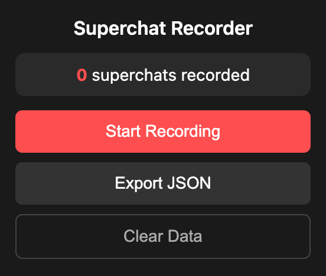

<p align="center">
  
</p>

# YouTube Live Superchat Recorder Extension

A simple Chrome extension that observes a live YouTube chat window, identifies and records superchat messages, and persists this data to local storage. It captures the author's name, the purchase amount (including currency), and the message content.

## Preview



## Features
- Automatically records superchat messages from YouTube live streams.
- Saves data (author, amount, message) to local storage.
- Records timestamp as UTC ISO strings.
- Popup UI allows viewing recorded superchats in real-time with localized timestamps inside a scrollable area.
- Export data as JSON.

## Sample Export JSON

```json
[
  {
    "author": "Alice",
    "amount": "$5.00",
    "message": "Love your content!",
    "timestamp": "2026-04-19T10:00:00.000Z"
  },
  {
    "author": "Bob",
    "amount": "¥1000",
    "message": "Keep it up",
    "timestamp": "2026-04-19T10:05:00.000Z"
  },
  {
    "author": "Charlie",
    "amount": "€10.00",
    "message": "Great stream",
    "timestamp": "2026-04-19T10:15:00.000Z"
  }
]
```

## Installation
1. Go to `chrome://extensions/` in your Chrome browser.
2. Enable "Developer mode" in the top right corner.
3. Click "Load unpacked".
4. Select the directory containing this extension.

## Usage
1. Make sure the extension is enabled.
2. Go to any YouTube live stream that has superchats in the live chat.
3. The extension will run in the background and record new superchats.
4. Click on the extension icon in the toolbar to view the collected superchats.
